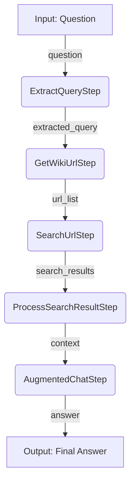

# PromptFlow to Semantic Kernel Process Framework Migration

This repository demonstrates how to migrate a PromptFlow application to the Semantic Kernel Process Framework, including evaluation and observability (tracing) capabilities.

## Project Structure

```text
.
├── main.py                       # Chat with Wiki Demo application
├── .env.sample                   # Environment variable template
├── pyproject.toml                # Project dependencies
└── src/
    └── wikipedia/                # Domain: Wikipedia (Chat with Wikipedia)
        ├── promptflow/           # Original PromptFlow implementation
        ├── process_framework/    # SK Process Framework implementation
        ├── evaluation/           # Evaluation suite for Wikipedia
        └── agent_service/        # Optional: Azure AI Agent Service demo
```

## Getting Started

### 1. Set up Environment Variables

Copy the sample `.env.sample` file to `.env` and update it.

```bash
cp .env.sample .env
```

### 2. Install Dependencies and Run

This project uses `uv` to manage the virtual environment and dependencies.

#### Running the Chat Demo

To run the interactive chat demo, which showcases the migrated Semantic Kernel process:

```bash
uv run main.py
```

#### Running the Evaluation

To run the evaluation suite against the `wiki.jsonl` dataset:

```bash
uv run -m src.wikipedia.evaluation.evaluate
```

The script will run the evaluators (Relevance, Retrieval, Groundedness) and print a detailed, color-coded report to the console. The full results are saved to `src/wikipedia/evaluation/evaluation_result.json`.

## Process Flow

The application logic is modeled as a series of connected steps within the Semantic Kernel Process Framework.



## Migration Overview

### Original PromptFlow Nodes → Process Steps

The core logic from the PromptFlow DAG was migrated to distinct, reusable `ProcessStep` classes.

| PromptFlow Node               | Process Step              | Description                                      |
| ----------------------------- | ------------------------- | ------------------------------------------------ |
| `extract_query_from_question` | `ExtractQueryStep`        | LLM call to refine user query **(stateful)**     |
| `get_wiki_url`                | `GetWikiUrlStep`          | Python tool to find Wikipedia URLs               |
| `search_result_from_url`      | `SearchUrlStep`           | Python tool to fetch content from URLs           |
| `process_search_result`       | `ProcessSearchResultStep` | Python tool to format search results             |
| `augmented_chat`              | `AugmentedChatStep`       | LLM call to generate final answer **(stateful)** |

## Migration Status

- [x] Copy the Chat with Wikipedia Flow
- [x] Rewrite the code with Semantic Kernel Process Framework
  - [x] Created process steps from original DAG nodes
  - [x] Extracted prompts into parametrized templates
  - [x] Migrated utility functions
  - [x] Built event-driven process flow
- [x] Add tracing and observability
- [x] Create evaluation dataset and metrics
  - [x] Implemented Relevance, Retrieval, and Groundedness evaluators
  - [x] Added pretty-printing for evaluation results
- [ ] Add red teaming capabilities
- [ ] Add a more complex SK Process Framework demo (leverage events, more complex flows, structured outputs, and agents with tools) ... e.g. https://github.com/jennifermarsman/MultiagentResearch
