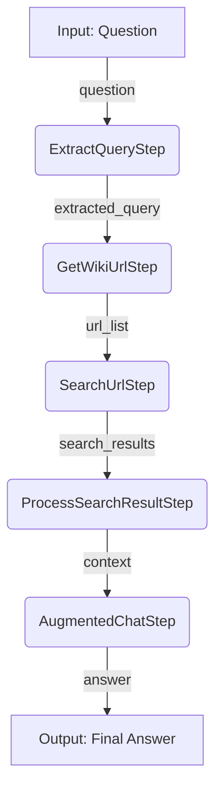

# PromptFlow to Semantic Kernel Process Framework Migration

This repository demonstrates how to migrate a PromptFlow application to the Semantic Kernel Process Framework.

## Project Structure

```text
├── src/
│   └── promptflow/                   # Original PromptFlow implementation (Chat with Wikipedia)
│       ├── flow.dag.yaml             # Original DAG definition
│       ├── *.py                      # Original Python tools
│       └── *.jinja2                  # Original prompt templates
│   └── process_framework/        # Semantic Kernel Process Framework implementation
│       ├── steps/                # Process steps
│       ├── prompts/              # Prompt templates
│       ├── utils/                # Utility functions (Wikipedia, Observability)
│       └── wiki_chat_process.py  # Main wiki chat process implementation
│   └── agent_service/            # Optional quick demo around Agent Service
│       ├── README.md             # Agent Service Demo Readme
│       ├── setup.py              # Agent Service Demo Setup
│       └── agent_service.py      # Agent Service Demo
└── main.py                       # Demo application
```

## Running the Demo

1.  **Set up environment variables**

    Copy the sample `.env.sample` file to `.env` and update it with your Azure OpenAI credentials.

    ```bash
    cp .env.sample .env
    ```

2.  **Run the demo**

    This project uses `uv` to manage dependencies and run the application. It will automatically create a virtual environment and install the required packages.

    ```bash
    uv run python main.py
    ```

## Process Flow



## Migration Overview

### Original PromptFlow Nodes → Process Steps

| PromptFlow Node               | Process Step              | Description                                      |
| ----------------------------- | ------------------------- | ------------------------------------------------ |
| `extract_query_from_question` | `ExtractQueryStep`        | LLM call to refine user query **(stateful)**     |
| `get_wiki_url`                | `GetWikiUrlStep`          | Python tool to find Wikipedia URLs               |
| `search_result_from_url`      | `SearchUrlStep`           | Python tool to fetch content from URLs           |
| `process_search_result`       | `ProcessSearchResultStep` | Python tool to format search results             |
| `augmented_chat`              | `AugmentedChatStep`       | LLM call to generate final answer **(stateful)** |

## Migration Status

- [x] Copy the Chat with Wikipedia Flow
- [x] Rewrite the code with Semantic Kernel Process Framework
  - [x] Created process steps from original DAG nodes
  - [x] Extracted prompts into parametrized templates
  - [x] Migrated utility functions
  - [x] Built event-driven process flow
- [x] Add tracing and observability
- [ ] Create evaluation dataset and metrics
- [ ] Add red teaming capabilities
