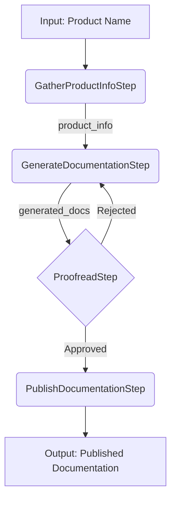

# SK Process Framework Example (Python)

This project is a hands-on example of using the [Semantic Kernel Process Framework](https://learn.microsoft.com/en-us/semantic-kernel/frameworks/process/examples/example-first-process?pivots=programming-language-python) for orchestrating multi-step AI workflows in Python. It demonstrates how to build an AI-powered process for generating product documentation, including a proofreading step that creates a feedback loop.

The code is based on (and adapted from) the official Microsoft tutorials:

- [Create your first Process](https://learn.microsoft.com/en-us/semantic-kernel/frameworks/process/examples/example-first-process?pivots=programming-language-python)
- [Using Cycles (Proofreading/Feedback Loop)](https://learn.microsoft.com/en-us/semantic-kernel/frameworks/process/examples/example-cycles?pivots=programming-language-python)

## Getting Started

### Environment Setup

You'll need an `.env` file in the root of the repository with your Azure OpenAI deployment details. See the provided `.env.sample` for the required variables:

```properties
API_KEY=...
ENDPOINT=...
DEPLOYMENT_NAME=...
```

### Running the Example

This project uses `uv` to manage the virtual environment and dependencies. To set up the environment and run the script, use the following commands from the root of the repository:

```sh
uv run .\src\copywriting\process_framework\main.py
```

`uv` will automatically install the required dependencies from `pyproject.toml` when you execute the script.

## Process Flow

The script `main.py` defines a process with several steps, including a proofreading cycle. If the generated documentation doesn't pass review, suggestions are sent back to the generator for revision, and the cycle repeats until the documentation is approved for publishing.

The process includes a proofreading step that creates a feedback loop, as illustrated below.



## Credits

Big thanks to the [Semantic Kernel team](https://github.com/microsoft/semantic-kernel) and the authors of the official tutorials. This repo is just a slightly annotated and fixed-up version of their great examples.
